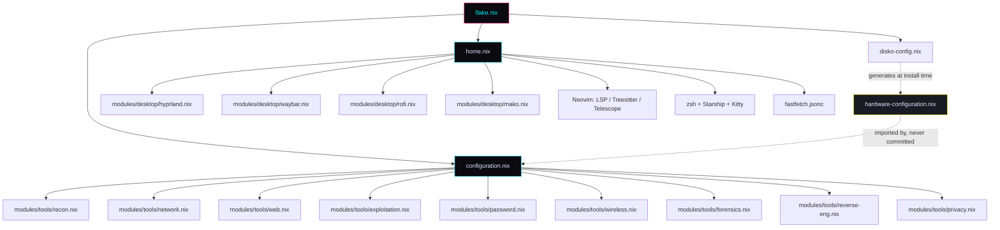
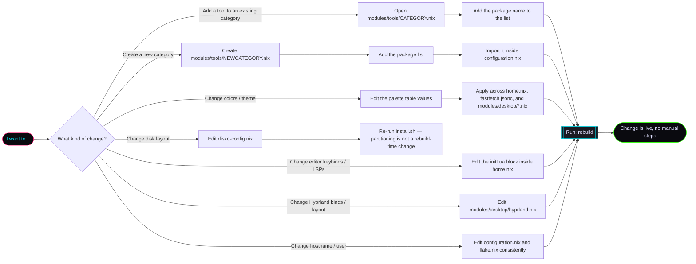

# cybersec-nixos

> Declarative, reproducible NixOS configuration for a cybersecurity workstation/VM.

Disk partitioning, system configuration, desktop environment (Hyprland), and a categorized offensive/defensive security toolset — all defined as code. Clone it, run the install flow, and get an identical, ready-to-use environment on any fresh NixOS minimal install, physical machine or VM.

This README is written to be readable by **both humans and AI coding assistants** — every file's responsibility is explicit, and the diagrams below describe the system's structure and change points so anyone (or anything) picking up this repo can navigate it without reading every line first.

---

## ⚠️ Disclaimer

This configuration bundles offensive security tools (network scanners, exploitation frameworks, password crackers, wireless attack tools, etc.).

**Use only on systems and networks you own or have explicit, written authorization to test.** Unauthorized access to computer systems is illegal in most jurisdictions. The author(s) of this repository are not responsible for misuse of the tools included here.

If you're learning: use isolated lab environments — local VMs, dedicated CTF platforms, or intentionally vulnerable targets built for practice.

---

## Stack

| Layer | Choice | Why |
|---|---|---|
| OS | NixOS (flakes) | Fully declarative, reproducible across machines |
| Disk partitioning | [disko](https://github.com/nix-community/disko) | No manual `parted`/`mkfs` — partitioning is code |
| Desktop / compositor | [Hyprland](https://hyprland.org) | Wayland-native tiling compositor, highly themeable |
| Status bar | Waybar | Themed to match the rice |
| Launcher | Rofi (Wayland) | Themed to match the rice |
| Notifications | Mako | Urgency-coded by theme color |
| Shell | zsh + Starship | Autosuggestions, syntax highlighting, custom prompt |
| Terminal | Kitty | GPU-accelerated, config-as-code |
| Editor | Neovim | LSP + Treesitter + Telescope, tuned for C/C++, Python, Bash, Rust, Nix, Assembly |
| System info | fastfetch | Themed to match the rice on every new shell |

---

## Visual identity ("the rice")

Inspired by the **Watch Dogs 2 / DedSec** aesthetic: black background, neon magenta and cyan accents, glitchy hacker-terminal feel. This palette is the single source of truth for every themed component (Kitty, Starship, Waybar, Rofi, Mako, fastfetch).

| Role | Hex | Used in |
|---|---|---|
| Background | `#0A0A0F` | Terminal, panels, Hyprland background |
| Primary accent (magenta) | `#FF2079` | Active window border, prompt, fastfetch logo |
| Secondary accent (cyan) | `#00F0FF` | Info text, git branch, fastfetch logo |
| Warning (amber) | `#F9E900` | Alerts, diagnostics |
| Success (green) | `#39FF14` | OK status, success symbol |
| Panel / inactive | `#1A1A22` | Inactive borders, Waybar background |
| Foreground | `#E0E0FF` | Primary text |

Font: **JetBrainsMono Nerd Font** (declared in `home.nix`) — provides the icon glyphs used across Waybar, Starship, Rofi, and fastfetch.

The terminal boots into a themed **fastfetch** banner (see `fastfetch.jsonc`) — the visual "signature" of the system and the fastest way to confirm the rice applied correctly after a fresh install.

---

## Architecture



**Reading this diagram:**
- `flake.nix` is the entry point — it declares inputs (nixpkgs, home-manager, hyprland, disko) and wires everything into one buildable system.
- `configuration.nix` is **system-level**: services, users, hostname, and it imports every tool module.
- `home.nix` is **user-level**: it owns the rice — desktop modules, editor, shell, terminal, fastfetch.
- `hardware-configuration.nix` is generated fresh on every install and is the **only** machine-specific file — it is never version-controlled.

---

## Installation

### Quick install (recommended)

```bash
nix-shell -p git --run "git clone https://github.com/YOUR_USERNAME/cybersec-nixos && cd cybersec-nixos && ./install.sh"
```

This handles disk selection, partitioning, hardware detection, and installation in one flow. For manual step-by-step control, see below.

### Prerequisites
- A machine or VM booted from the **NixOS minimal ISO** ([download](https://nixos.org/download))
- Internet connection
- UEFI boot mode

### Manual steps

**1. Boot the minimal ISO and connect to the network**

```bash
sudo systemctl start wpa_supplicant
wpa_cli
> add_network
> set_network 0 ssid "YOUR_SSID"
> set_network 0 psk "YOUR_PASSWORD"
> enable_network 0
> quit
```

**2. Clone this repository**

```bash
nix-shell -p git --run "git clone https://github.com/YOUR_USERNAME/cybersec-nixos && cd cybersec-nixos"
```

**3. Identify your target disk**

```bash
lsblk
```

Note the device name — e.g. `/dev/vda` (VM) or `/dev/nvme0n1` / `/dev/sda` (physical).

**4. Set the disk in the partitioning config**

```bash
sed -i "s|DISK_PLACEHOLDER|/dev/vda|g" disko-config.nix
```

**5. Partition and format**

```bash
sudo nix --extra-experimental-features "nix-command flakes" run github:nix-community/disko -- --mode disko ./disko-config.nix
```

**6. Generate the hardware configuration**

```bash
sudo nixos-generate-config --root /mnt --show-hardware-config > hardware-configuration.nix
```

Required on every fresh install — hardware-specific, never committed.

**7. Install**

```bash
sudo nixos-install --flake .#cybersec-vm
```

You'll be prompted to set a password for the `pentester` user.

**8. Reboot**

```bash
sudo reboot
```

Remove the installation media. The system boots into Hyprland with the full rice and toolset ready.

---

## Post-install shortcuts

```bash
rebuild        # apply config changes
update         # update flake inputs and rebuild
nixgarbage     # clean old generations, free disk space
```

---

## Toolset by category

### Reconnaissance & OSINT — `modules/tools/recon.nix`
`nmap` · `masscan` · `theHarvester` · `amass` · `subfinder` · `whois` · `dnsutils`

### Network Analysis — `modules/tools/network.nix`
`wireshark` · `tcpdump` · `netcat-gnu` · `socat` · `arp-scan` · `ettercap` · `bettercap`

### Web Application Security — `modules/tools/web.nix`
`burpsuite` · `sqlmap` · `gobuster` · `ffuf` · `nikto` · `httpie`

### Exploitation Frameworks — `modules/tools/exploitation.nix`
`metasploit` · `exploitdb` (includes `searchsploit`)

### Password & Credential Attacks — `modules/tools/password.nix`
`john` · `hashcat` · `thc-hydra` · `crunch` · `sshpass`

### Wireless Security — `modules/tools/wireless.nix`
`aircrack-ng` · `wireguard-tools` · `kismet`

### Digital Forensics & Incident Response — `modules/tools/forensics.nix`
`volatility3` · `binwalk` · `foremost` · `sleuthkit` · `exiftool`

### Reverse Engineering — `modules/tools/reverse-eng.nix`
`radare2` · `ghidra` · `gdb` · `binutils` (includes `objdump`) · `strace` · `ltrace`

### Anonymity & OPSEC — `modules/tools/privacy.nix`
`tor` · `torsocks` · `proxychains-ng` · `macchanger`

> **Note:** a few tools (`sherlock`, `wfuzz`, `cewl`, `reaverwps`, `autopsy`) are commented out in their respective modules pending a `nix search nixpkgs <name>` check — package availability/naming shifts over time. See the file itself for the current state.

---

## How to extend or modify this project



This flowchart is the intended starting point for **anyone or anything** — human contributor or AI assistant — reading this repository for the first time. Pick the branch matching your goal and follow it to the exact file to edit, without needing to read the entire codebase.

---

## File responsibility reference

| File | Owns | Do NOT put here |
|---|---|---|
| `flake.nix` | Inputs (nixpkgs, home-manager, hyprland, disko), system wiring | Tool lists, user preferences |
| `disko-config.nix` | Disk partitioning scheme | Anything unrelated to storage |
| `configuration.nix` | System services, users, hostname, module imports | Editor config, shell aliases, rice colors |
| `home.nix` | User environment: desktop modules, Neovim, zsh, Starship, Kitty, fastfetch | System services, disk config |
| `modules/tools/*.nix` | Package lists per security category | Desktop/rice settings |
| `modules/desktop/*.nix` | Hyprland, Waybar, Rofi, Mako — rice configuration | Package installation unrelated to the desktop |
| `fastfetch.jsonc` | System-info banner theme | Package installation |
| `install.sh` | Automated disk selection, partitioning, and install flow | Post-install configuration |
| `hardware-configuration.nix` | Machine-specific hardware detection | **Never edit or commit this manually** — regenerate per install |

---

## Status

✅ Core structure, tool modules, Hyprland/Waybar/Rofi/Mako rice, Neovim, and fastfetch theme all defined. Pending: verification of a few tool package names (see Toolset section) and a real install test on a fresh VM.

## License

This project is licensed under the **GNU General Public License v2.0 (GPL-2.0)** — the same license used by the Linux kernel.

You are free to use, modify, and distribute this configuration for any purpose. If you distribute a modified version, you must make your changes available under the same license — improvements stay open for everyone.

See [LICENSE](LICENSE) for the full text.